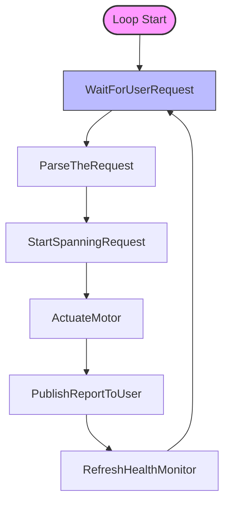

# Master firmware flow diagram

## Connection Block Diagram:



## WaitForUserRequest Flow Diaram

```mermaid
graph TD
    %% Nodes
    A([waitForUserRequest]) --> B[Hal_WaitForWanRequest]
    
    %% Branch 1: Hal Check
    B -->|Failed| C[SetError]
    B -->|Success| D[validateRequestIntegrity]
    graph TD
    %% Nodes
    A([waitForUserRequest]) --> B[Hal_WaitForWanRequest]
    
    %% Branch 1: Hal Check
    B -->|Failed| C[SetError]
    B -->|Success| D[validateRequestIntegrity]
    
    %% Branch 2: Integrity Check
    D -->|Failed| E[SetError]
    D -->|Success| F[Message Received]

    %% Styles
    style A fill:#f9f,stroke:#333,stroke-width:2px
    style C fill:#ffb3b3,stroke:#333,stroke-width:1px
    style E fill:#ffb3b3,stroke:#333,stroke-width:1px
    style F fill:#bbf,stroke:#333,stroke-width:2px

    %% Branch 2: Integrity Check
    D -->|Failed| E[SetError]
    D -->|Success| F[Message Received]

    %% Styles
    style A fill:#f9f,stroke:#333,stroke-width:2px
    style C fill:#ffb3b3,stroke:#333,stroke-width:1px
    style E fill:#ffb3b3,stroke:#333,stroke-width:1px
    style F fill:#bbf,stroke:#333,stroke-width:2px
```

## Parse the Request flow overview

```mermaid

```