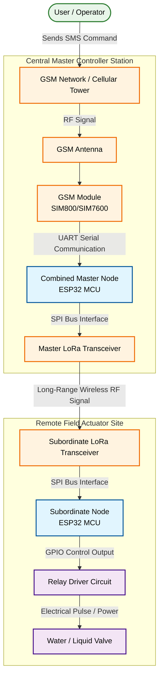
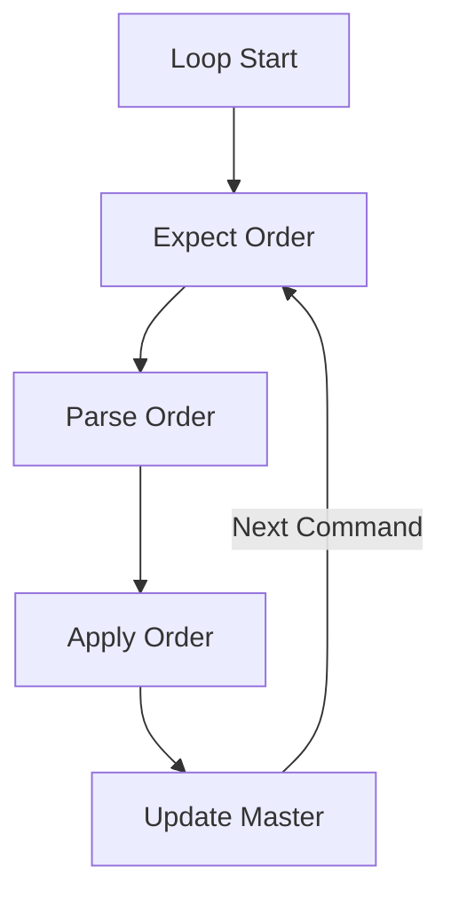
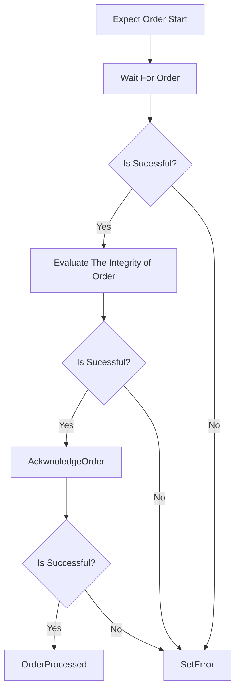
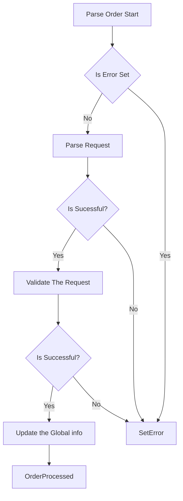
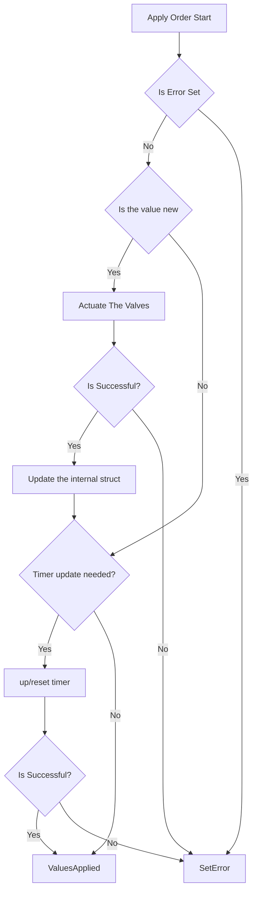
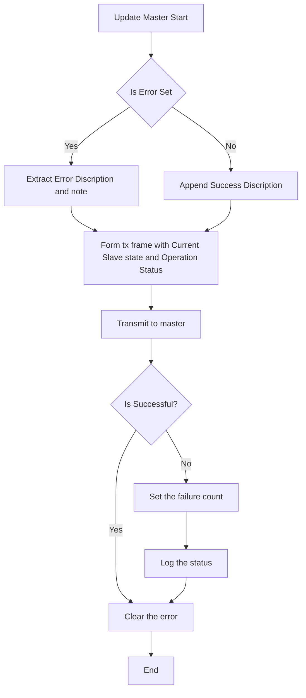

# Slave firmware flow diagram

## Connection Block Diagram:

## 1. Flow Overview:

## 2. Expect Order Overview:

## 3. Parse Order Overview:

## 4. Apply Order Overview:

## 5. Update Master Overview:

