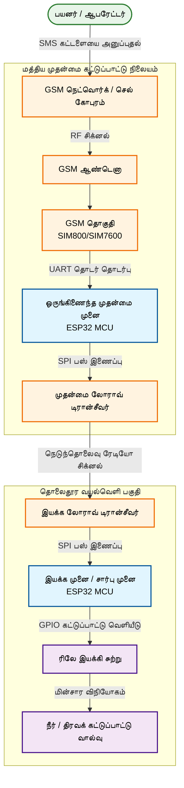
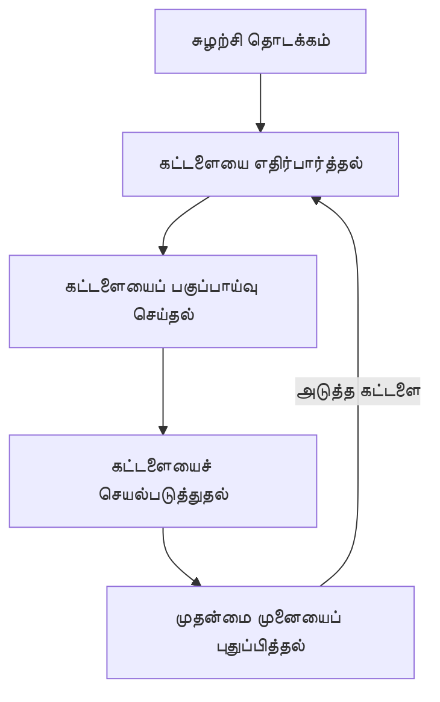
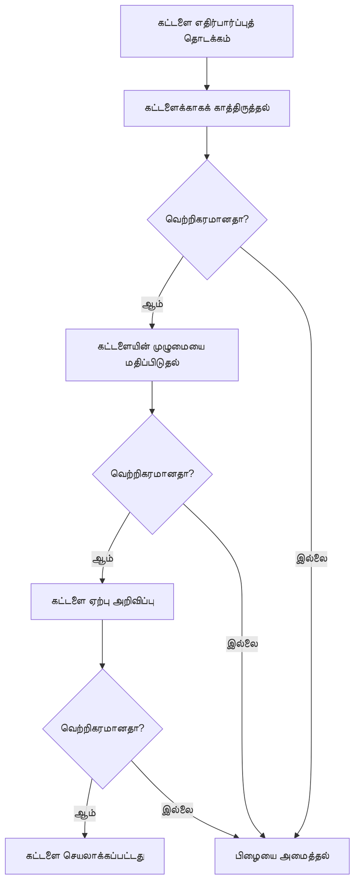
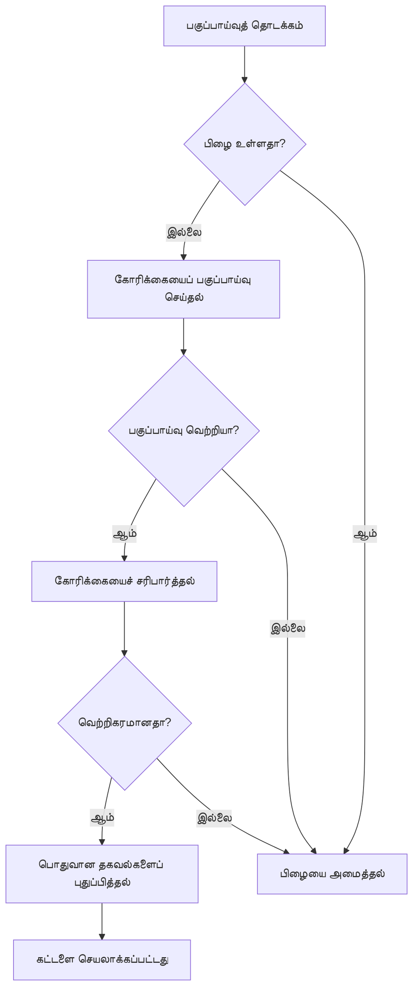
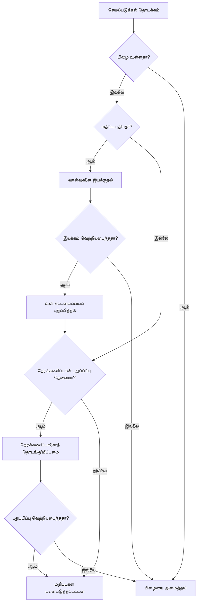
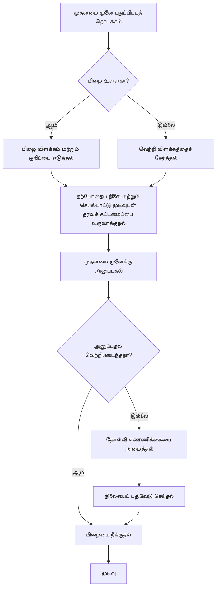

# இயக்க முனை மென்பொருள் பாய்வு விளக்கப்படம் (Subordinate Node Firmware Flow Diagram)

இந்த ஆவணம் முதன்மை முனையிலிருந்து (Master Node) கட்டளைகளைப் பெற்றுச் செயல்படும் துணைக்கருவி அல்லது இயக்க முனையின் (Subordinate/Actuator Node) மென்பொருள் பாய்வு கட்டமைப்பை விவரிக்கிறது.

---

## 1. பொதுவான பாய்வு மேலோட்டம் (Flow Overview)

இயக்க முனையின் முதன்மைச் சுழற்சி (Main Loop) செயல்பாட்டைக் காட்டும் பொதுவான வரைபடம்.

---

## 2. கட்டளையை எதிர்பார்த்தல் மேலோட்டம் (Expect Order Overview)

உள்வரும் தரவு பாக்கெட்டுகளைப் பெற்று, அவற்றின் நம்பகத்தன்மை மற்றும் முழுமையைச் சரிபார்க்கும் செயல்முறை.

---

## 3. கட்டளையைப் பகுப்பாய்வு செய்தல் மேலோட்டம் (Parse Order Overview)

பெறப்பட்ட தரவுக் கட்டளையிலிருந்து அளவுருக்களைப் பிரித்தெடுத்து, அவை கணினியால் ஏற்றுக்கொள்ளக்கூடிய எல்லைக்குள் உள்ளதா எனச் சரிபார்க்கும் முறை.

---

## 4. கட்டளையைச் செயல்படுத்துதல் மேலோட்டம் (Apply Order Overview)

சரிபார்க்கப்பட்ட மதிப்புகளை அடிப்படையாகக் கொண்டு வால்வுகளை இயக்குதல் மற்றும் நேரக்கணிப்பான்களை (Timers) அமைக்கும் பகுதி.

---

## 5. முதன்மை முனையைப் புதுப்பித்தல் மேலோட்டம் (Update Master Overview)

செயல்பாட்டின் இறுதி நிலையை (வெற்றி அல்லது தோல்வி விவரங்களுடன்) முதன்மை முனைக்குத் தகவல் பாக்கெட்டாகத் திருப்பி அனுப்பும் முறை.

