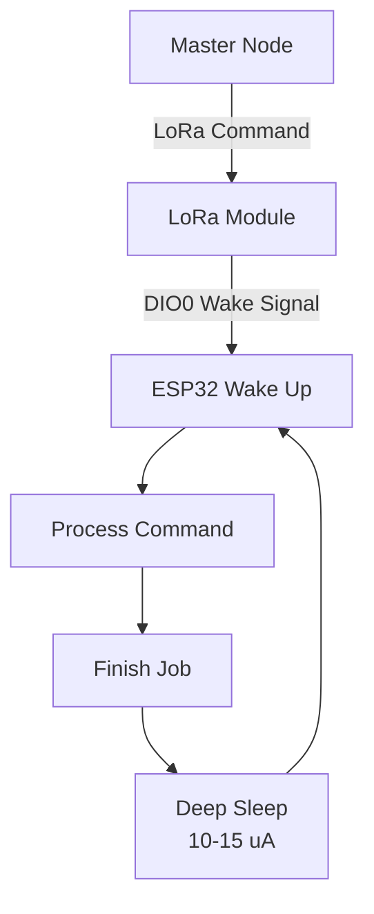

# Slave Node Requirements Specification

## Document Information

| Item | Description |
|--------|------------|
| Feature | LoRa Slave Node Firmware |
| Platform | ESP32 + LoRa |
| Version | 1.0 |
| Status | Draft |
| Owner | P&B Company |

---

# 1. Overview

The Slave Node shall receive commands from the Master Node through LoRa communication and perform actuator control, battery management, power management, and status reporting functions.

The design shall be optimized for low-power operation while maintaining responsiveness to commands from the Master Node.

---

# 2. Functional Requirements

## 2.1 Actuator Control

### FR-SLAVE-001: Open Operation

The Slave Node shall support opening the connected actuator upon receiving an OPEN command from the Master Node.

### Acceptance Criteria

- Receives OPEN command via LoRa.
- Validates command integrity.
- Executes actuator OPEN sequence.
- Reports operation result to Master.

---

### FR-SLAVE-002: Close Operation

The Slave Node shall support closing the connected actuator upon receiving a CLOSE command from the Master Node.

### Acceptance Criteria

- Receives CLOSE command via LoRa.
- Validates command integrity.
- Executes actuator CLOSE sequence.
- Reports operation result to Master.

---

## 2.2 Timed Operation

### FR-SLAVE-003: Open-Close Timed Cycle

The Slave Node shall support an operation where the actuator is opened and automatically closed after a predefined duration.

### Acceptance Criteria

- Receives timed operation command.
- Opens actuator.
- Starts timer.
- Closes actuator after timeout.
- Reports success/failure to Master.

### Configurable Parameters

- Open duration
- Retry count
- Timeout thresholds

---

# 3. Status Reporting

## 3.1 On-Demand Status Reporting

### FR-SLAVE-004: Status Request Response

The Slave Node shall transmit its current operational status when requested by the Master Node.

### Status Contents

- Device ID
- Current actuator state
- Battery percentage
- Battery zone
- LoRa status
- Sleep status
- Error codes
- Last operation status

### Acceptance Criteria

- Status shall be transmitted within defined response time.
- Master receives complete status packet.

---

## 3.2 Operation Completion Reporting

### FR-SLAVE-005: Operation Result Notification

The Slave Node shall automatically report the result of an operation immediately after completion.

### Trigger Events

- Open success
- Open failure
- Close success
- Close failure
- Timed operation success
- Timed operation timeout
- Internal fault

### Acceptance Criteria

- Result transmitted after operation completion.
- Appropriate success/failure code included.

---

# 4. Battery Management

## 4.1 Battery Monitoring

### FR-SLAVE-006: Battery Level Monitoring

The Slave Node shall periodically monitor battery voltage and estimate the battery percentage.

### Acceptance Criteria

- Battery percentage updated at configurable interval.
- Battery zone classification maintained.

---

## 4.2 Battery Zones

The Slave Node shall classify battery status into the following operational zones.

```c
BATTERY_ZONE_CRITICAL   // 0%  - 15%
BATTERY_ZONE_LOW        // 16% - 35%
BATTERY_ZONE_NORMAL     // 36% - 85%
BATTERY_ZONE_FULL       // 86% - 100%
```

---

## 4.3 Low Battery Reporting

### FR-SLAVE-007: Low Battery Warning

The Slave Node shall notify the Master Node when battery level enters the LOW zone.

### Acceptance Criteria

- Notification generated once upon entry into LOW zone.
- Notification contains battery percentage and zone.

---

## 4.4 Critical Battery Handling

### FR-SLAVE-008: Graceful Shutdown

The Slave Node shall perform a graceful shutdown when battery level enters the CRITICAL zone.

### Actions

1. Complete active operation (if possible).
2. Transmit critical battery notification.
3. Save operational state.
4. Enter low-power shutdown mode.

### Acceptance Criteria

- No corruption of persistent data.
- Critical battery notification sent before shutdown.

---

# 5. Power Cycle Management

## 5.1 ESP32 Power Management

### FR-SLAVE-009: Deep Sleep Support

The Slave Node shall support ESP32 Deep Sleep mode for power-saving operation.

### Low Power Architecture


### Acceptance Criteria

- ESP32 enters deep sleep during idle state.
- LoRa module triggers wake event through DIO0.
- Wake-up latency meets system requirements.

---

## 5.2 Wake-up Conditions

### FR-SLAVE-010: Wake-up Triggers

The Slave Node shall wake from sleep under the following conditions:

- Incoming LoRa command
- Configured timer event
- Low battery monitoring event
- System recovery event

---

# 6. LoRa Power Optimization

## 6.1 Smart Sleep

### FR-SLAVE-011: LoRa Smart Sleep

The LoRa subsystem shall support an intelligent sleep mechanism to reduce power consumption.

### Sleep Entry Conditions

The LoRa module may enter sleep when:

- Watering cycle has completed.
- No pending commands exist.
- No active communication session exists.

**Exact criteria shall be finalized during implementation.**

---

## 6.2 Scheduled Blind Window

### FR-SLAVE-012: Night-Time Sleep Window

The Slave Node shall support a configurable communication blind window during low-activity periods.

### Initial Requirement

```text
Start Time : 11:00 PM
End Time   : 04:00 AM
```

### Behavior

During the blind window:

- LoRa receive functionality may be disabled.
- Non-critical processing may be suspended.
- Battery monitoring shall remain active.

### Configurable Parameters

- Sleep start time
- Sleep end time
- Emergency wake-up exceptions

---

# 7. Fault Handling

## 7.1 Communication Failures

### FR-SLAVE-013

The Slave Node shall detect and report:

- Lost communication
- Invalid packets
- Packet CRC failures
- Command timeout conditions

---

## 7.2 Actuator Failures

### FR-SLAVE-014

The Slave Node shall detect and report:

- Failed open operation
- Failed close operation
- Operation timeout
- Position mismatch (if feedback sensor available)

---

# 8. Telemetry Packet Requirements

## Status Packet Contents

The following parameters shall be transmitted to the Master Node whenever status is requested or generated:

- Device ID
- Firmware version
- Current state
- Battery percentage
- Battery zone
- Supply voltage
- Actuator status
- Last operation result
- LoRa RSSI
- LoRa SNR
- Sleep status
- System uptime
- Error code

---

# 9. Future Enhancements

- OTA firmware updates via LoRa
- Secure command authentication
- Command acknowledgment and retransmission
- Multi-slave support
- Local event logging
- Water level sensing integration
- Solar charging support
- Predictive battery health monitoring

---

# Acceptance Summary

| Requirement Area | Acceptance Criteria |
|-----------------|--------------------|
| Open/Close Control | Command executed and status reported |
| Timed Operation | Actuator closed automatically after timeout |
| Status Reporting | Response sent on demand and after operations |
| Battery Monitoring | Accurate zone detection and reporting |
| Critical Battery | Graceful shutdown implemented |
| ESP32 Sleep | Deep sleep and wake-up functioning |
| LoRa Smart Sleep | Power optimization active |
| Blind Window | 11 PM to 4 AM operation supported |
| Fault Handling | Errors detected and reported |
| Telemetry | Status packet contains all required fields |